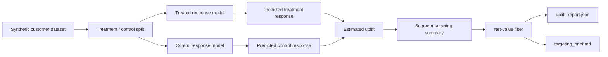

# uplift-decision-engine

A local-first uplift modeling workflow that simulates treatment and control outcomes, estimates heterogeneous treatment effects, and recommends which customer segments should receive an intervention.

## Problem

Many intervention systems target users with the highest baseline conversion score, but that is not the same as targeting users whose outcome will improve because of the intervention. This repo focuses on the business decision layer: estimating incremental lift and translating it into segment-level targeting guidance.

## Architecture

The implementation is intentionally compact and reproducible:

- a deterministic simulator creates treated and untreated customers across interpretable behavioral segments
- a T-learner estimates separate treated and control response probabilities
- an uplift layer computes per-customer treatment effect estimates and segment summaries
- an economics layer turns estimated uplift into expected net value after treatment cost
- a reporting layer emits both a machine-readable uplift report and a Markdown targeting brief
- the report now includes uplift-curve and Qini-style evaluation outputs
- a FastAPI endpoint serves the same top-segment recommendation that the CLI uses



## Causal Framing

This repo is about incremental impact, not raw conversion propensity. The core decision is:

```text
uplift(x) = P(convert | treatment=1, x) - P(convert | treatment=0, x)
```

That means a segment is only worth targeting when the intervention changes the outcome enough to justify the campaign. In practice, the repo runs a simple T-learner, then ranks segments by estimated incremental lift.

The shipped V2 decision rule adds basic treatment economics:

```text
expected_net_value_per_1000
= uplift(x) * expected_margin_per_conversion * 1000
  - treatment_cost_per_customer * 1000
```

Segments stay targetable only when both uplift and expected net value are positive.

### Example Output Schema

The `/recommendation` endpoint returns a JSON report shaped like this:

```json
{
  "customers_analyzed": 2400,
  "top_recommended_segment": "new_high_intent",
  "segment_summary": [
    {
      "segment": "new_high_intent",
      "estimated_uplift": 0.1234,
      "expected_net_value_per_1000": 6170.0,
      "recommended": true
    }
  ],
  "uplift_at_top_quartile": 0.5957,
  "portfolio_expected_net_value": 8241.53,
  "top_targets": [
    {
      "customer_id": "cust_0001",
      "segment": "new_high_intent",
      "estimated_uplift": 0.182341
    }
  ],
  "evaluation": {
    "uplift_curve": [
      {
        "fraction": 0.1,
        "customers_seen": 240,
        "treated_rate": 0.2500,
        "control_rate": 0.1200,
        "uplift": 0.1300
      }
    ],
    "qini_curve": [
      {
        "fraction": 0.1,
        "customers_seen": 240,
        "cumulative_gain": 18.0000,
        "random_baseline_gain": 5.0000,
        "qini_gain": 13.0000
      }
    ],
    "qini_auc": 0.1234
  }
}
```

## Tradeoffs

This implementation makes three deliberate tradeoffs:

1. The dataset is synthetic so the full uplift workflow is reproducible locally and does not depend on external experimentation data.
2. The model uses a simple T-learner with gradient boosting instead of a more specialized uplift package because the repo needs to stay easy to run and inspect.
3. Recommendations are segment-driven rather than an always-on treatment policy so the business action remains interpretable.

## Repo Layout

```text
uplift-decision-engine/
├── app/
│   ├── cli.py
│   ├── dataset.py
│   ├── main.py
│   ├── reporting.py
│   └── uplift.py
├── generated/
└── tests/
```

## Run Steps

### Install Dependencies

```bash
git clone https://github.com/srn91/uplift-decision-engine.git
cd uplift-decision-engine
python3 -m pip install -r requirements.txt
```

### Generate the Uplift Report

```bash
make report
```

That writes:

- `generated/uplift_report.json`
- `generated/targeting_brief.md`

### Start the API

```bash
make serve
```

Useful endpoints:

- `http://127.0.0.1:8003/health`
- `http://127.0.0.1:8003/recommendation`

### Run the Full Quality Gate

```bash
make verify
```

## Hosted Deployment

- Live URL: [https://uplift-decision-engine.onrender.com](https://uplift-decision-engine.onrender.com)
- First path to click: `/health`, then `/recommendation`
- Browser smoke: passed on `/recommendation`; direct HTTP to `/health` and `/recommendation` returned `200`
- Render config: Git-backed Python web service on `main`, `buildCommand=python3 -m pip install -r requirements.txt`, `startCommand=uvicorn app.main:app --host 0.0.0.0 --port $PORT`, `healthCheckPath=/health`, `plan=free`, `region=oregon`, auto-deploy enabled

## Validation

The repo currently verifies:

- deterministic treated and control data generation
- positive estimated uplift for high-intent, price-sensitive users
- negative or weak uplift for low-value segments that should not be targeted
- positive expected net value for the recommended segments after treatment cost
- machine-readable and operator-facing targeting outputs derived from the same model run

Current expected report snapshot:

- customers analyzed: `2400`
- recommended segment: `new_high_intent`
- uplift-at-top-quartile: `0.5957`
- bottom segment remains non-targeted because estimated uplift is near zero or negative

Local quality gates:

- `make lint`
- `make test`
- `make report`
- `make verify`

## Current Capabilities

The repo demonstrates:

- deterministic intervention dataset generation
- T-learner treatment-effect estimation
- segment-level targeting recommendations
- treatment-cost and net-value-aware targeting recommendations
- uplift-aware report artifacts
- uplift-curve and Qini-style evaluation artifacts
- FastAPI surface for the top recommendation summary
