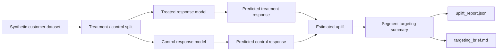

# uplift-decision-engine

A local-first uplift modeling workflow that simulates treatment and control outcomes, estimates heterogeneous treatment effects, and recommends which customer segments should receive an intervention.

## Problem

Many intervention systems target users with the highest baseline conversion score, but that is not the same as targeting users whose outcome will improve because of the intervention. This repo focuses on the business decision layer: estimating incremental lift and translating it into segment-level targeting guidance.

## Architecture

The V1 implementation is intentionally compact and reproducible:

- a deterministic simulator creates treated and untreated customers across interpretable behavioral segments
- a T-learner estimates separate treated and control response probabilities
- an uplift layer computes per-customer treatment effect estimates and segment summaries
- a reporting layer emits both a machine-readable uplift report and a Markdown targeting brief
- a FastAPI endpoint serves the same top-segment recommendation that the CLI uses



## Tradeoffs

This V1 makes three deliberate tradeoffs:

1. The dataset is synthetic so the full uplift workflow is reproducible locally and does not depend on external experimentation data.
2. The model uses a simple T-learner with gradient boosting instead of a more specialized uplift package because the repo needs to stay easy to run and inspect.
3. Recommendations are segment-driven rather than an always-on treatment policy so the business action remains interpretable.

## Repo Layout

```text
uplift-decision-engine/
├── app/
│   ├── cli.py
│   ├── dataset.py
│   ├── main.py
│   ├── reporting.py
│   └── uplift.py
├── generated/
└── tests/
```

## Run Steps

### Install Dependencies

```bash
git clone git@github.com:srn91/uplift-decision-engine.git
cd uplift-decision-engine
python3 -m pip install -r requirements.txt
```

### Generate the Uplift Report

```bash
make report
```

That writes:

- `generated/uplift_report.json`
- `generated/targeting_brief.md`

### Start the API

```bash
make serve
```

Useful endpoints:

- `http://127.0.0.1:8003/health`
- `http://127.0.0.1:8003/recommendation`

### Run the Full Quality Gate

```bash
make verify
```

## Validation

The V1 repo currently verifies:

- deterministic treated and control data generation
- positive estimated uplift for high-intent, price-sensitive users
- negative or weak uplift for low-value segments that should not be targeted
- machine-readable and reviewer-facing targeting outputs derived from the same model run

Current expected report snapshot:

- customers analyzed: `2400`
- recommended segment: `new_high_intent`
- uplift-at-top-quartile: at least `0.09`
- bottom segment remains non-targeted because estimated uplift is near zero or negative

Local quality gates:

- `make lint`
- `make test`
- `make report`
- `make verify`

## Current Capabilities

The V1 repo demonstrates:

- deterministic intervention dataset generation
- T-learner treatment-effect estimation
- segment-level targeting recommendations
- uplift-aware report artifacts
- FastAPI surface for the top recommendation summary

## Next Steps

Realistic follow-up work for the next milestone:

1. add uplift curves and Qini-style evaluation
2. compare T-learner against doubly robust or meta-learner baselines
3. add policy constraints such as budget caps or fairness limits
4. simulate treatment cost and net value, not just raw uplift
5. connect the workflow to an experimentation or campaign-decision system
